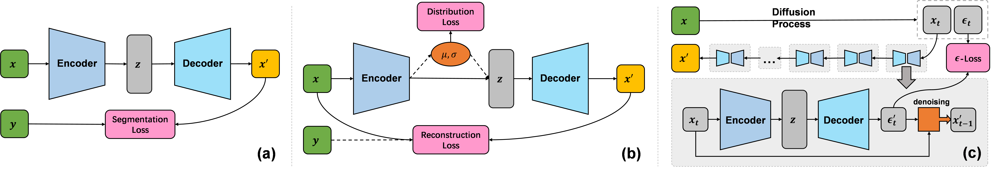
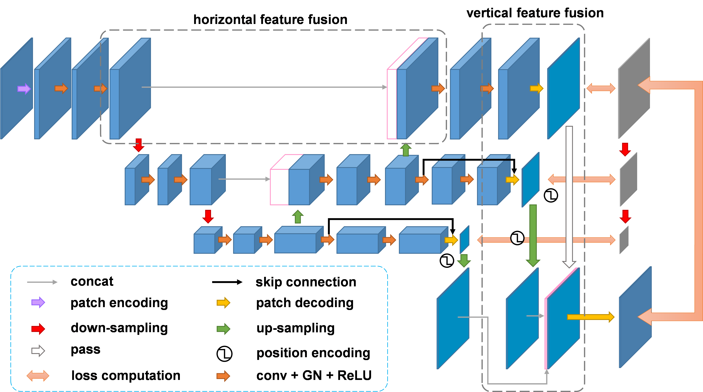

=====================
Model Architectures
=====================
Flemme supports various architectures for segmentation, reconstruction and generation tasks, but they are all built from a base encoder-decoder architecture.

Base Architectures
==================

Base Architectures contains a encoder and decoder. The number of input channels of a base model is determined by the encoder, and the number of output channels is determined by the decoder. However, it contains several optional components for context embedding.

There are two main differences between condition embedding :math:`c` and time-step embedding :math:`t`. 

- :math:`c` can be encoded for both encoder and decoder
- :math:`c` is combined with :math:`x` and :math:`z` before encoding and decoding, while :math:`t` is an optional independent input of encoder and decoder. Actually, :math:`t` is the input of each building block in encoder and decoder.

We formulate context embedding as following equations to help you understand the above rules:

.. math::
    \begin{equation}
    \label{equ:forward}
    \begin{split}
    &z = \mathcal{E}\left(x + \mathcal{C}_e (c), \mathcal{T}(t)\right),\\
    &\mathcal{M}(x, c, t) = \mathcal{D}\left( z + \mathcal{C}_d (c), \mathcal{T}(t )\right),
    \end{split}
    \end{equation}

Context embeddings can also be defined in the configuration files. 
In Flemme, :math:`t` and :math:`c` usually denote time-step (for diffusion models) and conditions. If you want to process :math:`c` like :math:`t`, set ``merge_timestep_and_condition`` as **True**.

Condition embedding
-------------------

Flemme supports several ways for condition embedding, such as one-hot embedding and sinusoidal positional embedding for category and position/time-step. 
If the condition is a image or point cloud, any encoders introduced in  `Encoders <encoder.html>`_ can be employed.

.. code-block:: yaml
  :linenos:

  condition_embedding:
    # how to combine condition embedding and input. Can be one of ['cat', 'add']
    combine_condition: cat
    # merge time-step embedding and context embedding, default: false
    # if you set this as true, 
    # make sure context embedding is a embedding vector and can be merged.
    merge_timestep_and_condition: false
    # condition embedding for encoder
    encoder:
      ## The condition embedding name should be one of [Identity, OneHot, Time] + supported encoders.
      ## Usually, you need to specity the output channel, 
      ## unless you are using a supported encoder, 
      ## whose the output channel will be determined automaticlly.
      name: Identity
      out_channel: 1
    # contition embedding for decoder
    decoder:
      ## define a cnn encoder for condition embedding
      name: CNN
      image_size: [320, 256]
      in_channel: 3
      patch_channel: 32
      patch_size: 2
      down_channels: [64, 128, 256]
      middle_channels: [512, 512]
      dense_channels: [128]
      building_block: conv
      normalization: batch

In the above, we simply concat the input and condition for condition embedding of encoder. For decoder, we use an CNN encoder to encode the condition.

Time-step embedding
-------------------
For time-step, we use sinusoidal positional embedding. 
You just need to specify the feature channel of time-step in model configuration.

.. code-block:: yaml
  :linenos:

  model:
    name: Base
    # time step embedding
    time_channel: 128
    # condition embedding
    condition_embedding:
      combine_condition: cat
      merge_timestep_and_condition: false
      encoder:
        name: Identity
        out_channel: 1
      ## there is no condition embedding for decoder
    encoder:
      ## define a encoder you want ...

Base architecture are not directly trainable. You will need to define the losses for specific tasks. Three main derived architectures are illustrated in the following figure: 
**(a) Segmentation Model (SeM); (b) Auto-Encoder (AE); (c) Denoising Diffusion Probabilistic Model (DDPM)**

Segmentation Model
===================

For **segmentation**, we provide ``SeM`` architecture (Segmentation Model), which is a simple extension of the base architecture. You need to define ``segmentation_losses`` for ``SeM``. The following block define a segmentation model using a hybrid loss combining Dice and BCE loss. For all supported losses, 
please refer to `Losses <loss.html>`_.

.. code-block:: yaml
  :linenos:
  
  model:
  ## model architecture, SeM indicates Segmentation Model
    name: SeM
    # loss function of architecture. For SeM, you need to specify the segmentation loss.
    segmentation_losses: 
      - name: Dice  
        weight: 1.0
      - name: BCEL
        weight: 1.0
    encoder:
      ## define a encoder you want ...

Auto-Encoder
==============

For **reconstruction**, we provide ``AE`` architecture (AutoEncoder). You need to define ``reconstruction_losses`` for ``AE``, which can be a list or a single term.
``AE`` can be unsupervised or supervised.

.. code-block:: yaml
  :linenos:
  
  model:
    # can be AE, VAE and DDPM
    name: AE
    ### loss function for reconstruction
    reconstruction_losses: 
      name: MSE
    is_supervising: true
    encoder:
      ## define a encoder you want ...

Variational Auto-Encoder
-------------------------

AutoEncoder can be regularized by distribution losses to learn a more continuous latent representation and have a certain capability of generation, which is also known as ``VAE``. A ``VAE`` can be defined as following configuration:

.. code-block:: yaml
  :linenos:

  model:
    name: VAE
    reconstruction_losses: 
      name: MSE
    distribution_loss:
      name: KL
      ## global weight for loss
      weight: 0.01
    encoder:
      ## define a encoder you want ...

Denoising Diffusion Probabilistic Model
=======================================

In DDPM, base architecture serves as a noise predictor, which are called :math:`\epsilon`-model. The loss is named as :math:`\epsilon`-loss. We won't talk much about DDPM that can be refer to `this nice blog <https://lilianweng.github.io/posts/2021-07-11-diffusion-models>`_. 
To define a DDPM in Flemme, you may need to construct a config file as the following:

.. code-block:: yaml
  :linenos:

  model:
    name: DDPM
    ## number of time steps
    num_steps: 1000
    ## noise scheduler
    beta_schedule: consine
    ## define a classifier free guidance
    ## the eps-model should be conditional
    classifier_free_guidance:
      condition_dropout: 0.2
      guidance_weight: 2.0
    ## eps loss
    eps_loss:
      name: MSE
    ## define eps-model, which is the noise predictor
    eps_model:
      ### number of channels for time-step embedding
      ### time-step embedding will be processed in each building block
      time_channel: 128
      ### conditional DDPM
      ### this model take the class label as condition
      condition_embedding:
        combine_condition: add
        merge_timestep_and_condition: true
        encoder:
          name: OneHot
          type: categories
          out_channel: 128
          num_classes: 10
      ### define the encoder of eps-model
      encoder:
        ### we always recommend U-shaped networks for DDPM
        name: UNet
        #### other parameters related to the encoder

Denoising Diffusion Implicit Model
-----------------------------------

We support to use ``DDIM`` to accelerate sampling process of ``DDPM``. You can directly change ``DDPM`` to ``DDIM`` in test configuration file without re-training the model. You can also directly train a ``DDIM`` model, or train a ``DDIM`` model from a ``DDPM`` checkpoint.

.. code-block:: yaml
  :linenos:

  model:
    name: DDIM
    # number of sampling steps, default is 100
    num_sample_steps: 100
    # other parameters stay the same as DDPM configuration

Althrough fully sampled images from ``DDPM`` model might have better quality than the images generated by ``DDIM``.  We still recommand you to use ``DDIM`` instead of ``DDPM`` if you want to visualize the generated results during training process. 
Because a full sampling for ``DDPM`` might be very slow. If you set a small number of sample steps for `sampler <sampler.html>`_, the generated results could be very unclear (see `generated results on MNIST datasets <https://github.com/wlsdzyzl/flemme/blob/main/images/ddpm_mnist.png>`_).

Latent Diffusion Model
-----------------------

Latent diffusion models (LDM) perform diffusion and reverse diffusion process on latent space. 
Therefore, we need a auto-encoder to construct latent space. 
Similar to ``DDPM`` and ``DDIM``, we have ``LDPM`` (Latent Diffusion Probabilistic Model) and ``LDIM`` (Latent Diffusion Implicit Model).

Latent diffusion contains two sub models: an :math:`\epsilon`-model and an auto-encoder (can be ``AE`` or ``VAE``).
The following configuration files define a point cloud LDM. Latent diffusion model is still in test. Feel free to contact me if you want to know more. 

.. code-block:: yaml
  :linenos:

  model:
    name: LDPM
    n_steps: 1000
    beta_schedule: consine
    ## ae model
    ## you can choose to freeze the auto-encoder, or update its' weights
    freezed_ae: true
    ## path of pre-trained ae
    ae_path: path/to/auto-encoder.pth
    ae_model:
      name: VAE
      encoder:
        name: PointNet
        in_channel: 3
        point_num: 1024
        building_block: single
        conv_channels: [64, 128, 256, 512]
        dense_channels: [1024]
        decode_dense_channels: [1024, 512, 256]
        activation: lrelu
        pointwise: False
      reconstruction_losses: 
        - name: EMD
      distribution_loss:
        name: KL
        weight: 0.1
    ## eps model
    eps_model:
      # encoder config
      time_channel: 128
      encoder:
        name: PointWise
        in_channel: 1024
        dense_channels: [1024, 2048, 4096]
        building_block: res_dense
        activation: silu
        normalization: layer
        dropout: 0.1
        data_form: VEC

Supervised Diffusion Model
---------------------------

Supervised diffusion model can be consider to use generation model for reconstruction (or segmentation). 
For image restoration, you may input a noisy image :math:`x`, and want to recover the clear image :math:`y`.
You can easily to train a ``AE`` for this task, by use :math:`x` as input and :math:`y` as target.

If we want to use a diffusion model to do such things, we can use :math:`x` as condition to generate :math:`y`. 
We wrap these process as ``SDPM`` (Supervised Diffusion Probabilistic Model) and ``SDIM`` (Supervised Diffusion Implicit Model), 
so you can use them like an ``AE`` or ``SeM``. ``SDIM`` uses a accelerated and determined sampling strategy and can be directly test on the trained ``SDPM``.

Because SDM are based on conditional diffusion models, you need to specify the condition embedding. The configuration file of a ``SDPM`` looks like the following: 

.. code-block:: yaml
  :linenos:

  model:
    # can be AE, VAE and DDPM
    name: SDIM
    num_steps: 1000
    num_ensemble: 1
    beta_schedule: consine
    eps_loss:
      name: MSE
    eps_model:
      time_channel: 128
      encoder:
        name: SwinU
        image_size: [320, 320]
        in_channel: 1
        out_channel: 1
        patch_channel: 32
        patch_size: 2
        down_channels: [64, 128, 256]
        middle_channels: [512, 512]
        building_block: double_swin
        abs_pos_embedding: false
        window_size: 10
        num_blocks: 1
      condition_embedding:
        combine_condition: cat
        merge_timestep_and_context: false
        encoder:
          name: Identity
          out_channel: 1

Hierarchical Architectures
===========================

We extend base architecture and propose a generic hierarchical architecture combining a pyramid loss for vertical feature fusion.

Details of our hierarchical architecture can refer to our paper. Theoretically, we can build hierarchical versions for all supported architectures.
However, we don't recommend to use this design for diffusion model based methods. 
Because we predict noise instead of reconstructing the image in the reverse diffusion process. 
Noise usually doesn't contain clear global structures, and scaling the noise map may cause severe loss of details.
Therefore, we construct hierarchical segmentation model and auto-encoder denoted as ``HSeM`` and ``HAE`` for image segmentation and reconstruction. Note that ``HSeM`` and ``HAE`` are not supported for point cloud segmentation and reconstruction.

To summarize, we have the following architectures:

==========  ====================
Archi       Applicable tasks  
==========  ====================
SeM, HSeM   Segmentation
AE, HAE     Reconstruction
VAE         Reconstruction, Generation
DDPM, DDIM  Generation
SDPM, SDIM  Reconstruction, Segmentation, Generation
LDPM, LDIM  Generation
==========  ====================