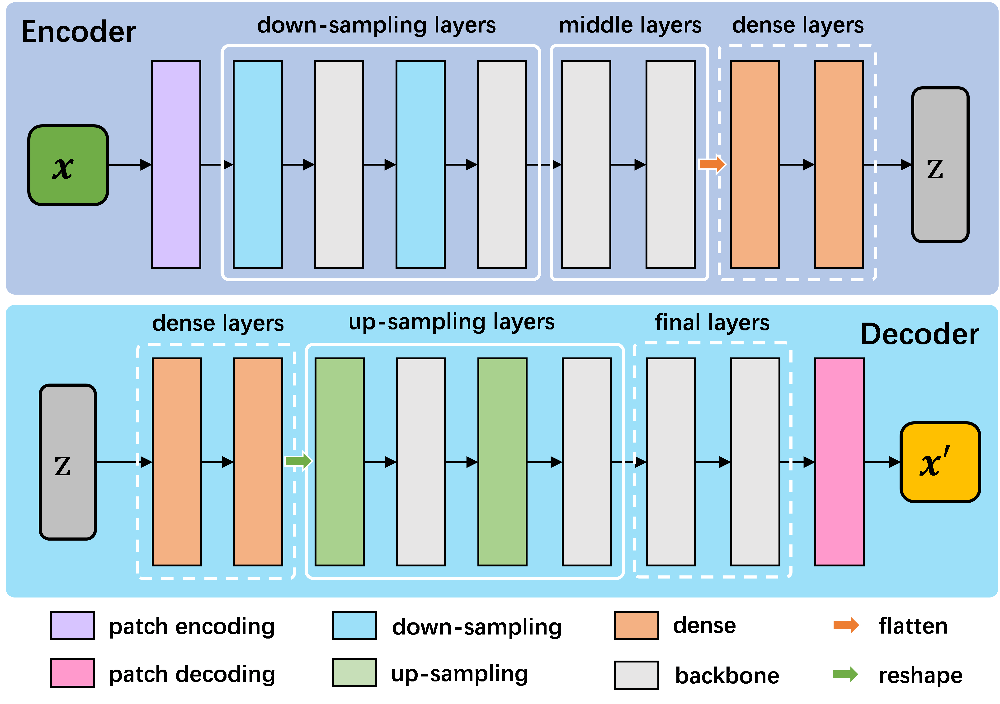

==============
Image Encoders
==============

Flemme supports various image encoders using convolution, transformer and SSM as backbones. All encoders and decoders follow a pipeline illustrated in following figure:

We will elaborate supported encoders in the remainder of this article.

CNN
===

CNN indicates the encoders using **convolution** as backbones. To initialize a CNN encoder, you need to specify the following parameters:

.. code-block:: python
    :linenos:

    CNNEncoder.__init__(self, image_size, 
                    ## number of input channels
                    image_channel = 3, 
                    ## number of input time channels (context embedding t) 
                    time_channel = 0, 
                    ## number of image patch channels
                    patch_channel = 32, 
                    ## size of image patch
                    patch_size = 2,
                    ## number of channel for each down-sample layer
                    ## The length of list is the number of down-sample layers
                    down_channels = [64, 128], 
                    ## attention of each down-sample layers following convolution, should be one of [None, 'atten', 'ftt_atten']
                    ## defaut value is None
                    ## the length of this list should be equal to len(down_channels)
                    down_attens = [None, None], 
                    ## shape scaling for each layer, after down-sampling the image shape becomes [H, W, D] / shape_scaling
                    shape_scaling = [2, 2],  
                    ## number of channel for each middle layer
                    ## The length of list is the number of middle layers
                    middle_channels = [256, 256], 
                    ## attention of each middle layers,
                    middle_attens = [None, None], 
                    ## define the convolution: depth-wise and kernel size
                    depthwise = False, kernel_size = 3, 
                    ## number of channels for each dense layer (fully-connected layer)
                    ## fc_channels can be an empty list, indicating there is no dense layer in the encoder 
                    fc_channels = [256], 
                    ## method fur dowm-samping, can be one of ['conv', 'inter'], indicate using convolution and interpolation
                    dsample_function = 'conv', 
                    ## building block, can be one of ['conv', 'double_conv', 'res_conv']
                    building_block='conv', 
                    ## normalization, can be one of ['batch', 'group', 'instance', 'layer']
                    normalization = 'group', num_group = 8, 
                    ## order of convolution and normalization in building block
                    cn_order = 'cn', 
                    ## number of building blocks in each layer
                    num_block = 2,
                    ## activation for building blocks
                    activation = 'relu', 
                    ## parameters related to attentions following convolution
                    dropout = 0.1, num_heads = 1, d_k = None, qkv_bias = True, qk_scale = None, atten_dropout = None, 
                    ## add position embedding for constructed image patch
                    abs_pos_embedding = False, 
                    ## some parameters determined by architectures.
                    return_features = False, z_count = 1, 
                    **kwargs)
``CNNDecoder`` has very similar parameters for initialization. But most of the parameters can be derived from the encoder:

.. code-block:: python
    :linenos:

    CNNDecoder.__init__(self, 
                    ## same as the encoder
                    image_size,
                    ## number of output channels. 
                    ## if not specified, it is set to the image channel of the encoder.
                    image_channel = 3, 
                    ## number of latent channels (z, the output of encoder)
                    ## derived from encoder
                    in_channel = 256,  
                    ## you can specify the following parameters, but we recommend to use the default choices
                    ## by default, we reverse the correspondings in encoder
                    fc_channels = [32], 
                    up_channels = [128, 64], 
                    up_attens = [None, None],
                    shape_scaling = [2, 2], 
                    ## you can specify these optional parameters
                    ## but using default values is also a good choice
                    final_channels = [], 
                    final_attens = [], 
                    usample_function = 'conv', 
                    ## same as the encoder
                    patch_size = 2, 
                    time_channel = 0, 
                    depthwise = False, 
                    kernel_size = 3, 
                    building_block='single', 
                    normalization = 'group', 
                    num_group = 8, 
                    cn_order = 'cn', 
                    num_block = 2, 
                    activation = 'relu', 
                    dropout=0.1, num_heads = 1, d_k = None, qkv_bias = True, qk_scale = None, atten_dropout = None, 
                    ## parameter determined by architectures.
                    return_features = False, 
                    **kwargs)

The aboved parameters can be defined in the config file, in which the ``in_channel`` and ``out_channel`` refer to the ``image_channel`` of encoder and decoder respectively., ``decoder_fc_channel`` refers to ``fc_channel`` of decoder.
As we discussed before, you don't need to define all parameters for encoder and decoder in the configuration file, most parameter of decoder can be directly derived from encoder. However, you can specify some of them for more flexible usage.

.. code-block:: yaml
    :linenos:

    encoder:
        name: CNN
        in_channel: 1
        out_channel: 1
        ## the value can be list or int
        image_size: 32
        patch_size: 1
        patch_channel: 32
        ### up-sampling function
        usample_function: conv
        ### down-sampling function
        dsample_function: conv
        ## down channels, indicating an up_channels: [32, 16]
        down_channels: [16, 32]
        ## attentions for down-sampling layers
        ## if the value is not a list, it will be transfered to a list with a same length of down-sampling layers: None -> [None, None]
        down_attens: null
        ## attentions for up-sampling layers
        up_attens: [null, atten]
        middle_channels: [32, 32]
        # up_channels: [16, 8]
        building_block: conv
        fc_channels: [128]
        decoder_fc_channels: [128, 64]

Supported building_block for CNN encoder and decoder: ``[conv, res_conv, double_conv]``.

ViT
===
ViT indicates the encoders using **vision transformer** as backbones. To initialize a ViT encoder and decoder, you need to specify the following parameters:

.. code-block:: python
    :linenos:

    ViTEncoder.__init__(self, 
                    # similar parameters with CNN encoder
                    image_size, 
                    image_channel = 3, 
                    patch_size = 2, 
                    patch_channel = 32,
                    building_block = 'vit', 
                    fc_channels = [256], 
                    time_channel = 0,
                    down_channels = [128, 256], 
                    ## number of heads for MSA in each down-sample layer, defaut value is 3
                    ## The length of list is the number of down-sample layers
                    down_num_heads = [3, 3], 
                    ## number of heads for MSA in each middle layer
                    middle_channels = [256, 256], 
                    middle_num_heads = [3, 3],
                    normalization = 'layer', num_group = 8, 
                    num_block = 2, 
                    activation = 'silu', 
                    abs_pos_embedding = False,
                    return_features = False,
                    z_count = 1, 
                    # parameters related to multi-head self attention and vit building block
                    ## define the length of MLP layers and channels, channel = ratio * block_in_channel
                    mlp_hidden_ratio=[4., ], 
                    qkv_bias=True, qk_scale=None, 
                    ## dropout information
                    dropout=0., 
                    atten_dropout=0., 
                    drop_path=0.1, 
                    **kwargs)

.. Initialization of ViTDecoder:

.. .. code-block:: python
..     :linenos:

..     ViTDecoder.__init__(self, 
..                     # similar with ViT encoder and CNN decoder
..                     image_size, 
..                     image_channel = 3, 
..                     in_channel = 64,
..                     patch_size = 2, 
..                     fc_channels = [32], 
..                     building_block = 'vit',
..                     time_channel = 0,
..                     mlp_hidden_ratio=[4., ], 
..                     up_channels = [128, 64], 
..                     up_num_heads = [3, 3], 
..                     final_channels = [64, 64], 
..                     final_num_heads = [3, 3],
..                     normalization = 'layer', 
..                     num_group = 8, 
..                     num_block = 2, 
..                     activation = 'silu', 
..                     return_features = False, 
..                     qkv_bias=True, 
..                     qk_scale=None, 
..                     dropout=0., 
..                     atten_dropout=0., 
..                     drop_path=0.1, 
..                     **kwargs)

Supported building_block for ViT encoder and decoder: ``[vit]``.

Swin
====
Swin indicates the encoders using Swin transformer as backbones, 
which is a vision transformer using shifted window and relative position embedding. 
Swin encoder and decoder inherit from ViT. To initialize a Swin encoder and decoder, 
you need to specify the following parameters:

.. code-block:: python
    :linenos:

    SwinEncoder.__init__(self, 
                    image_size, 
                    image_channel = 3, 
                    # size of window, can be a list whose length is equal to the dimension of image, or a integer.
                    window_size = 8, 
                    time_channel = 0,
                    patch_size = 2, 
                    patch_channel = 32,
                    building_block = 'swin', 
                    fc_channels = [256], 
                    mlp_hidden_ratio=[4., ], 
                    qkv_bias=True, qk_scale=None, 
                    down_channels = [128, 256], 
                    middle_channels = [256, 256], 
                    down_num_heads = [3, 3], 
                    middle_num_heads = [3, 3],
                    dropout=0., 
                    atten_dropout=0., 
                    drop_path=0.1, 
                    normalization = 'layer', 
                    num_group = 8, 
                    num_block = 2, 
                    activation = 'silu', 
                    abs_pos_embedding = False,
                    return_features = False,
                    z_count = 1, 
                    **kwargs)

.. Initialization of SwinDecoder:

.. .. code-block:: python
..     :linenos:

..     SwinDecoder.__init__(self, 
..                     image_size, 
..                     image_channel = 3, 
..                     in_channel = 64,
..                     # size of window, same as the encoder
..                     window_size = 8, 
..                     patch_size = 2, 
..                     fc_channels = [32], 
..                     building_block = 'swin', 
..                     time_channel = 0,
..                     mlp_hidden_ratio=[4., ], 
..                     qkv_bias=True, qk_scale=None, 
..                     up_channels = [128, 64], 
..                     final_channels = [64, 64], 
..                     up_num_heads = [3, 3], 
..                     final_num_heads = [3, 3],
..                     dropout=0., 
..                     atten_dropout=0., 
..                     drop_path=0.1, 
..                     normalization = 'layer', 
..                     num_group = 8, 
..                     num_block = 2, 
..                     activation = 'silu', 
..                     return_features = False, 
..                     **kwargs)

As you can see, the only different between defining a ViT encoder and Swin encoder is that you need to specify the ``window_size``. 
Supported building_block for Swin encoder and decoder: ``[swin, double_swin, res_swin]``.

VMamba
====
VMamba indicates the encoders using **vision mamba** as backbones. To initialize a VMamba encoder and decoder, 
you need to specify the following parameters:

.. code-block:: python
    :linenos:

    VMambaEncoder.__init__(self, 
                    # same as ViT
                    image_size, 
                    image_channel = 3, 
                    patch_size = 2, 
                    patch_channel = 32,
                    time_channel = 0,
                    down_channels = [128, 256], 
                    middle_channels = [256, 256], 
                    mlp_hidden_ratio=[4., ], 
                    building_block = 'vmamba', 
                    fc_channels = [256],
                    dropout=0., 
                    drop_path=0.1, 
                    normalization = 'layer', 
                    num_group = 8, 
                    num_block = 2, 
                    activation = 'silu',
                    abs_pos_embedding = False,
                    return_features = False,
                    z_count = 1, 
                    # parameters related to Mamba SSM
                    # details of these parameter can refer to the source code
                    # default values give satisfactory results  
                    state_channel=None, 
                    conv_kernel_size=3,
                    inner_factor = 2.0,
                    dt_min=0.001, dt_max=0.1, 
                    dt_init_floor=1e-4, 
                    conv_bias=True, 
                    bias=False,             
                    ## cross-scan module, should be one of [single, simplified, cross]
                    ## the corresponding times of scanning are 1, 2, 2 and 1, 2, 6 for 2D and 3D image patches, respectively. 
                    scan_mode = 'single',
                    ## Flip the scanning, double the scanning times
                    flip_scan = True,
                    head_channel = 64, 
                    chunk_size=256, **kwargs)

.. Initialization of VMambaDecoder:

.. .. code-block:: python
..     :linenos:

..     VMambaDecoder.__init__(self, image_size, image_channel = 3, 
..                 patch_size = 2, in_channel = 64,
..                 mlp_hidden_ratio=[4., ], fc_channels = [32], 
..                 up_channels = [128, 64], final_channels = [64, 64], 
..                 time_channel = 0,
..                 building_block = 'vmamba',
..                 state_channel=None, 
..                 conv_kernel_size=3,
..                 inner_factor = 2.0, 
..                 dt_rank=None, dt_min=0.001, 
..                 dt_max=0.1, dt_init="random", dt_scale=1.0, 
..                 dt_init_floor=1e-4, 
..                 conv_bias=True, bias=False,
..                 head_channel = 64, 
..                 learnable_init_states = True, 
..                 chunk_size=256,             
..                 dropout=0., drop_path=0.1, 
..                 normalization = 'layer', num_group = 8, 
..                 num_block = 2, activation = 'silu', 
..                 scan_mode = 'single', flip_scan = True, 
..                 return_features = False,
..                 **kwargs)
Supported building_block for Swin encoder and decoder: ``[vmamba, vmamba2, double_vmamba, double_vmamba2, res_vmamba, res_vmamba2]``.