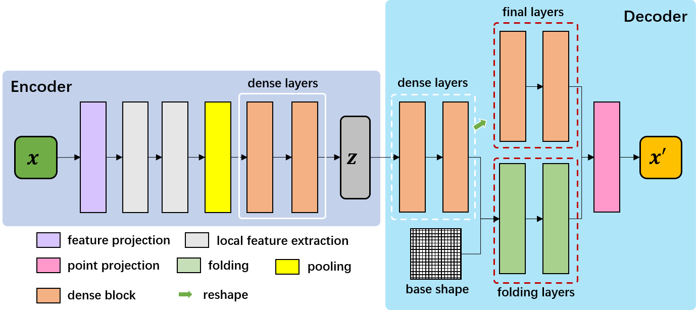
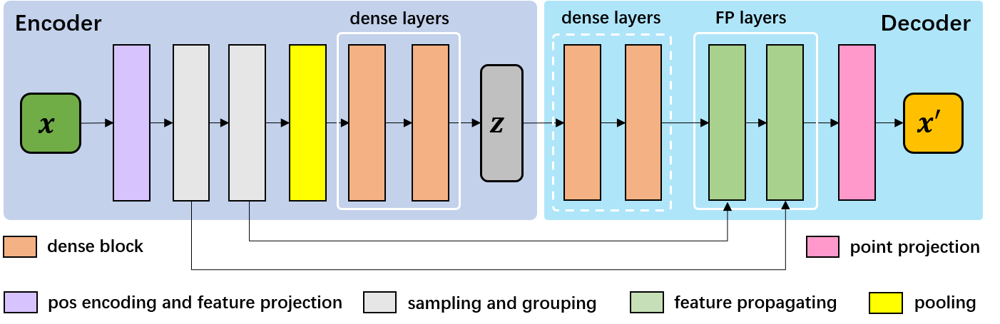
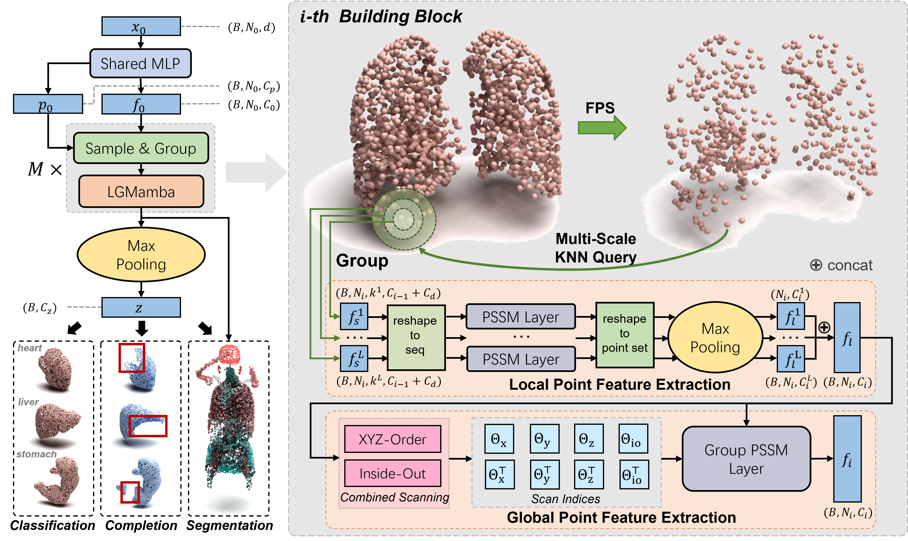

=====================
Point Cloud Encoders
=====================

Flemme supports various point cloud encoders using MLP (1-D convolution), transformer and SSM as backbones. Flemme accommodates both non-hierarchical and hierarchical architectural designs for point cloud encoders and decoders.

Non-Hierarchical
================
Non-hierarchical encoders and decoders follow a pipeline illustrated in following figure (similar to PointNet and DGCNN):

Note that only one of the components enclosed within red dashed box should be employed. 

PointNet
--------

``PointNetEncoder`` use **sharedMLP** as backbones and has a similar architecture to `PointNet <https://arxiv.org/abs/1612.00593>`_. In addition, we also integrate dynamic local feature extraction (from `DGCNN <https://arxiv.org/abs/1801.07829>`_) into ``PointNetEncoder``. To initialize a PointNet encoder, you need to specify the following parameters:

.. code-block:: python
    :linenos:

    PointNetEncoder.__init__(self, point_dim=3, 
                projection_channel = 64,
                time_channel = 0,
                ## parameter of KNN for local feature extraction.
                ## if num_neighbors_k is set as 0, local feature extraction will not be performed.
                num_neighbors_k=0, 
                local_feature_channels = [64, 64, 128, 256], 
                num_blocks = 2,
                dense_channels = [256, 256],
                building_block = 'dense', 
                normalization = 'group', 
                num_norm_groups = 8, 
                activation = 'lrelu', 
                dropout = 0., 
                z_count = 1, 
                ## If vector_embedding is true, the latent embedding is a vector;
                ## otherwise, the latent embedding is point-wise features. 
                vector_embedding = True, 
                last_activation = True, 
                **kwargs)

In the above, if ``num_neighbors_k`` is specified, we will use edge convolution to extraction dynamic local features through KNN algorithm. Otherwise, local features will not be computed.
If ``vector_embedding`` is set as ``True``, the encoder will return a latent vector for each inputs. Otherwise, the encoder will return point-wise features.

``PointNetDecoder`` is used to decode points from latent space through MLPs, which can used for reconstruction, segmentation, and other tasks. Typically, we dirrectly recover points from latent embeddings. In addition, we also integrate **Folding** operation (from `FoldingNet <https://arxiv.org/abs/1712.07262>`_) into ``PointNetDecoder`` when you specify ``folding_times``. We support ``grid2d``, ``grid3d``, ``cylinder``, ``uvsphere`` and ``icosphere`` as base shapes for folding operation.
Note that ``PointNetDecoder`` can be used for all point cloud encoders. 

.. code-block:: python
    :linenos:

    PointNetDecoder.__init__(self, point_dim=3, 
                point_num = 2048, 
                ## out_channel of encoder is the in channel of decoder
                in_channel = 256, 
                dense_channels = [256], 
                time_channel = 0,
                normalization = 'group', 
                num_norm_groups = 8, 
                activation = 'lrelu', 
                dropout = 0., 
                ## if folding_times > 0, we will perform folding operations.
                folding_times = 0, 
                ## channel of hidden layers in folding operations.
                folding_hidden_channels = [512, 512],
                base_shape_config = {},
                num_blocks = 2,
                ## If folding_times = 0, we process results through a final MLPs.
                final_channels = [512, 512],
                ## Note that vector_embedding need to be True if you want to perform folding operations.
                vector_embedding = True, 
                **kwargs)

The aboved parameters can be defined in the config file, in which the ``in_channel`` and ``out_channel`` refer to the ``point_dim`` of encoder and decoder respectively., ``decoder_fc_channel`` refers to ``fc_channel`` of decoder.
As we discussed before, you don't need to define all parameters for encoder and decoder in the configuration file.

.. code-block:: yaml
    :linenos:

    encoder:
        name: PointNet
        in_channel: 3
        out_channel: 46
        point_num: 2048
        building_block: dense
        # num_neighbors_k: 20
        local_feature_channels: [64, 64, 128, 256, 512]
        dense_channels: [1024, 512, 256]
        final_channels: [512, 512]
        activation: lrelu
        normalization: group

Supported ``building_block`` for PointNet encoder and decoder: ``[dense, res_dense, double_dense]``.

PointTrans
----------
PointTrans indicates the encoders have a similar architecture as PointNet encoder but using **transformer** as backbones. To initialize a ``PointTransEncoder``, you need to specify the following parameters:

.. code-block:: python
    :linenos:

    PointTransEncoder.__init__(self, point_dim=3, 
                 projection_channel = 64,
                 time_channel = 0,
                 num_neighbors_k=0, 
                 local_feature_channels = [64, 64, 128, 256], 
                 num_blocks = 2,
                 dense_channels = [256, 256],
                 building_block = 'pct_sa', 
                 normalization = 'group', num_norm_groups = 8, 
                 activation = 'lrelu', dropout = 0., 
                 ### transformer parameters
                 num_heads = 4, d_k = None, 
                 qkv_bias = True, 
                 qk_scale = None, 
                 atten_dropout = None, 
                 residual_attention = False, 
                 skip_connection = True,
                 z_count = 1, 
                 vector_embedding = True, 
                 last_activation = True,
                 **kwargs)

Note that ``PointTransDecoder`` is just an alias of ``PointNetDecoder``. Supported ``building_block`` for PointTrans encoder: ``[pct_sa, pct_oa]``, with ``pct_sa`` denoting self-attention and ``pct_oa`` denoting offset-attention from `PCT <https://arxiv.org/abs/2012.09688>`_, respectively.

PointMamba
----------

PointMamba indicates the encoders using **state space model (mamba)** as backbones. To initialize a ``PointMambaEncoder``, 
you need to specify the following parameters:

.. code-block:: python
    :linenos:

    PointMambaEncoder.__init__(self, point_dim=3, 
                projection_channel = 64,
                time_channel = 0,
                num_neighbors_k=0, 
                local_feature_channels = [64, 64, 128, 256], 
                num_blocks = 2,
                dense_channels = [256, 256],
                building_block = 'pmamba', 
                normalization = 'group', num_norm_groups = 8, 
                activation = 'lrelu', dropout = 0.,
                state_channel = 64, 
                conv_kernel_size = 4, inner_factor = 2.0,  
                head_channel = 64,
                conv_bias=True, bias=False,
                learnable_init_states = True, chunk_size=256,
                dt_min=0.001, A_init_range=(1, 16),
                dt_max=0.1, dt_init_floor=1e-4, 
                dt_rank = None, dt_scale = 1.0,
                z_count = 1, vector_embedding = True, 
                last_activation = True,
                skip_connection = True,
                **kwargs)

Note that ``PointMambaDecoder`` is just an alias of ``PointNetDecoder``. Supported ``building_block`` for PointMamba encoder: ``[pmamba, pmamba2]``.

Hierarchical
============
Hierarchical point cloud encoders and decoders follow a pipeline illustrated in following figure (similar to PointNet++):

In hierarchical encoders, we down-sample point cloud into different levels through the farthest-point sampling (FPS) and aggregate points through multi-scale neighbor queries.  

We will elaborate supported hierarchical encoders in the remainder of this article.

PointNet2
----------
PointNet2 has a hierarchical architecture with sharedMLP backbones. To define a ``PointNet2Encoder``, you need to specify the following parameters:

.. code-block:: python
    :linenos:

    PointNet2Encoder.__init__(self, point_dim = 3,
                 projection_channel = 64,
                 time_channel = 0,
                 ## number of fps points for each level
                 num_fps_points = [1024, 512, 256, 64],
                 ## number of neighbor query for each level
                 num_neighbors_k = 32,
                 ## max radius of radius query for each level  
                 neighbor_radius = [0.1, 0.2, 0.4, 0.8], 
                 ## number of feature channels for each level
                 fps_feature_channels = [128, 256, 512, 1024], 
                 num_blocks = 2,
                 ## number of scales
                 ## the radius and number of feature channels at each scale will be assigned based on the neighbor_radius and fps_feature_channels
                 num_scales = 2,
                 ## concat point position embedding in feature extraction
                 use_xyz = True,
                 ## sort the radius query results by distance (knn query returns a sorted result by default).
                 sorted_query = False,
                 ## use knn query or radius query.
                 ## if knn_query is not false, it should be one of ['xyz', 'xyz_embed', 'feature'], which determine the knn query space.
                 knn_query = False,
                 dense_channels = [1024],
                 building_block = 'dense', 
                 normalization = 'group', num_norm_groups = 8, 
                 activation = 'lrelu', dropout = 0., 
                 vector_embedding = True, 
                 ## if the decoder is a pointnet2-like decoder, the feature list will also be returned.
                 is_point2decoder = False,
                 z_count = 1, 
                 return_xyz = False,
                 last_activation = True,
                 ## final concatenation of sample features at different levels
                 final_concat = False,
                 ## enable positional embedding
                 pos_embedding = False,
                 **kwargs)

PointTrans2
-----------

PointTrans2 has a hierarchical architecture with **transformer** backbones. To define a ``PointTrans2Encoder``, you need to specify the following parameters:

.. code-block:: python
    :linenos:

    PointTrans2Encoder.__init__(self, point_dim = 3,
                 projection_channel = 64,
                 time_channel = 0,
                 num_fps_points = [1024, 512, 256, 64],
                 num_neighbors_k = 32,
                 neighbor_radius = [0.1, 0.2, 0.4, 0.8], 
                 fps_feature_channels = [128, 256, 512, 1024], 
                 num_blocks = 2,
                 num_scales = 2,
                 use_xyz = True,
                 sorted_query = False,
                 knn_query = False,
                 dense_channels = [1024],
                 building_block = 'dense', 
                 normalization = 'group', num_norm_groups = 8, 
                 activation = 'lrelu', dropout = 0., 
                 num_heads = 4, d_k = None, 
                 qkv_bias = True, qk_scale = None, atten_dropout = None, 
                 residual_attention = False, skip_connection = True,
                 vector_embedding = True, 
                 is_point2decoder = False,
                 ## Perform long range modeling on a global scale.
                 ## Long range modeling is only suitable for sequence-modeling backbones, e.g., transformer and ssm.
                 long_range_modeling = False,
                 z_count = 1, 
                 return_xyz = False,
                 last_activation = True,
                 final_concat = False,
                 pos_embedding = False,
                 **kwargs)

PointMamba2
-----------
PointMamba2 has a hierarchical architecture with **state space model (mamba)** backbones. 

A more detailed illustration of PointMamba2 Encoder with xyz&center scanning and long-range modeling is presented in:

To define a ``PointMamba2Encoder``, you need to specify the following parameters:

.. code-block:: python
    :linenos:

    PointMamba2Encoder.__init__(self, point_dim = 3,
            projection_channel = 64,
            time_channel = 0,
            num_fps_points = [1024, 512, 256, 64],
            num_neighbors_k = 32,
            neighbor_radius = [0.1, 0.2, 0.4, 0.8], 
            fps_feature_channels = [128, 256, 512, 1024], 
            num_blocks = 2,
            num_scales = 2,
            use_xyz = True,
            sorted_query = False,
            knn_query = False,
            dense_channels = [1024],
            building_block = 'dense', 
            flip_scan = False,
            normalization = 'group', num_norm_groups = 8, 
            activation = 'lrelu', dropout = 0., 
            vector_embedding = True, 
            state_channel = 64, 
            conv_kernel_size = 4, inner_factor = 2.0,  
            head_channel = 64,
            conv_bias=True, bias=False,
            learnable_init_states = True, chunk_size=256,
            dt_min=0.001, A_init_range=(1, 16),
            dt_max=0.1, dt_init_floor=1e-4, 
            dt_rank = None, dt_scale = 1.0,
            skip_connection = True,
            is_point2decoder = False,
            long_range_modeling = False,
            ## point serialization
            ## scan strategies should be a list whose elements are from ['x_order', 'y_order', 'z_order', 'center_dist', 'nonsort']
            scan_strategies = None,
            z_count = 1, 
            return_xyz = False,
            last_activation = True,
            final_concat = False,
            pos_embedding = False,
            **kwargs)

To summarize, we support the following point cloud encoders:

========================  ====================  ==============================  ===========================  ===========
Encoder                   Backbones             Building Blocks                 Long-range Modeling          Scanning
========================  ====================  ==============================  ===========================  ===========
PointNet                  MLP                   dense, double_dense, res_dense  ×                            ×
PointNet2                 MLP                   dense, double_dense, res_dense  ×                            ×
PointTrans                transformer           pct_sa, pct_oa                  ×                            ×
PointTrans2               transformer           pct_sa, pct_oa                  √                            ×
PointMamba                ssm (mamba)           pmamba, pmamba2                 ×                            ×
PointMamba2               ssm (mamba)           pmamba, pmamba2                 √                            √
========================  ====================  ==============================  ===========================  ===========