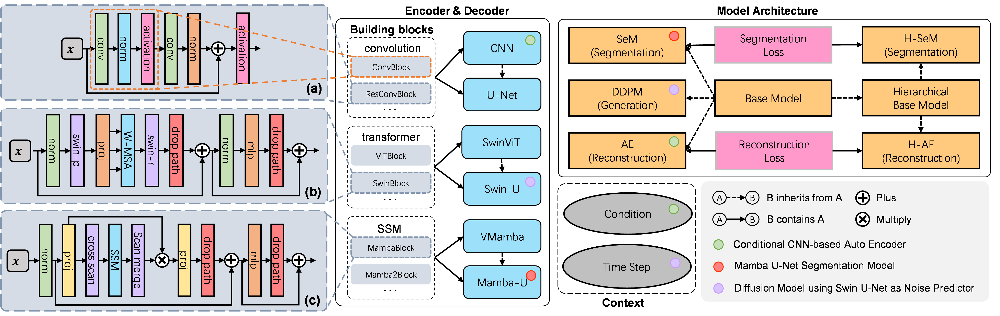

.. flemme-docs documentation master file, created by
   sphinx-quickstart on Sun Aug 18 23:40:28 2024.
   You can adapt this file completely to your liking, but it should at least
   contain the root `toctree` directive.

===================================================================
Flemme: A FLExible and Modular Learning Platform for MEdical Images
===================================================================

Flemme is a flexible and modular learning platform for medical images. 

The above is an overview of Flemme. In Flemme, we separate encoders from the model architectures, enabling fast model construction via different combinations for medical image segmentation, reconstruction and generation.

We support encoders using **convolution**, **transformer** and **SSM (state-space model)** as backbones. For model architectures, we implement the base architecture following an encoder-decoder style. Several derived architectures are used for segmentation, reconstruction and generation tasks. 

We are also working on Flemme to support **point cloud** modeling.

Now, let's get Started with Flemme!

Install Flemme
==============

Requirement list
=======================
You need to install some necessary packages before using flemme. 

.. code-block:: console

   torch torchvision simpleitk nibabel matplotlib scikit-image scikit-learn tensorboard

The following packages are optional. You can modify `Gloal Configuration <global_config.html>`_ to disable some components of Flemme so that you don't need to install the corresponding required packages.

.. code-block:: console

   # For swin-transformer
   einops
   # For vision mamba
   mamba-ssm (CUDA version >= 11.6)
   # For io and evaluation of point cloud
   POT plyfile

After installing the required packages, now you can install Flemme into your environment.

.. code-block:: console

   git clone git@github.com:wlsdzyzl/flemme.git
   cd flemme
   python setup.py install

Train a Model
=============
It's quite easy to build and train a deep learning model with Flemme, you don't even need to write any codes. All things can be down through a ``yaml`` Configuration file.

Let's start with a easy one: a simple U-Net for medical image segmentation. Firstly, you need to create a config file and copy the contents from `train_unet_sem.yaml <train_unet_sem.html>`_. Then, run the following command:

.. code-block:: console

   train_flemme path/to/config/train_unet_sem.yaml

To visualize the training process

.. code-block:: console

   tensorboard --logdir path/to/checkpoint/CVC-ClinicDB/UNet
To test the results, you need to create a test config file that looks like `test_unet_sem.yaml <test_unet_sem.html>`_ and run:

.. code-block:: console

   test_flemme path/to/config/test_unet_sem.yaml

In the following modules, we elaborate supported architectures, encoders and other components of flemme. 

.. toctree::
   :maxdepth: 2
   :caption: Modules
   
   archi
   encoder
   dataset
   loss
   eval
   global_config

.. toctree::
   :maxdepth: 2
   :caption: Example configuration files

   train_unet_sem
   test_unet_sem

