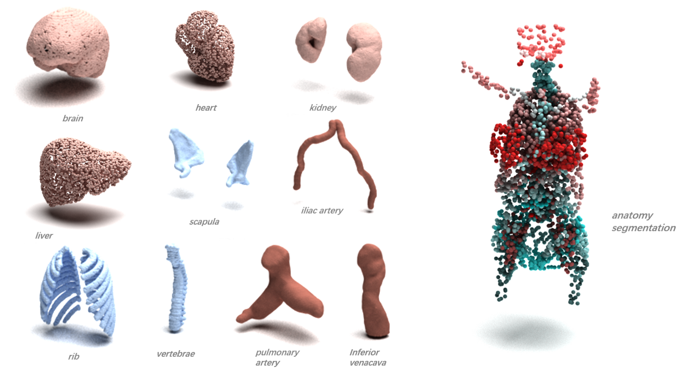

=================
*MedPointS* Dataset
=================
*MedPointS* is a large-scale medical point cloud dataset based on `MedShapeNet <https://medshapenet.ikim.nrw/>`_ for anatomy classification, completion, and segmentation.

Specifically, we select patients from *MedShapeNet* with relatively complete body part scans and compile a classification dataset comprising 28,737 anatomical structures across 46 categories, with each sample containing no more than 16,384 points.  For the completion task, an anchor point is randomly selected from each point cloud, and 20\% of the nearest points are removed to generate its incomplete counterpart. Furthermore, we integrate these anatomical structures based on their corresponding patients to create an anatomy segmentation dataset containing 1,020 samples, each of which has 65,536 points. 

An overview of *MedPointS* is presented int the following figure:

*MedPointS* can be downloaded from this `link <https://pan.baidu.com/s/1OKiglb6FtGmBLNwhVQXz9Q?pwd=cs27>`_.

Alternatively, you can use load the dataset from Hugging Face: `MedPoints-cls <https://huggingface.co/datasets/wlsdzyzl/MedPointS-cls>`_, `MedPoints-cpl <https://huggingface.co/datasets/wlsdzyzl/MedPointS-cpl>`_, and `MedPoints-seg <https://huggingface.co/datasets/wlsdzyzl/MedPointS-seg>`_ for classification, completion, and segmentation tasks. 