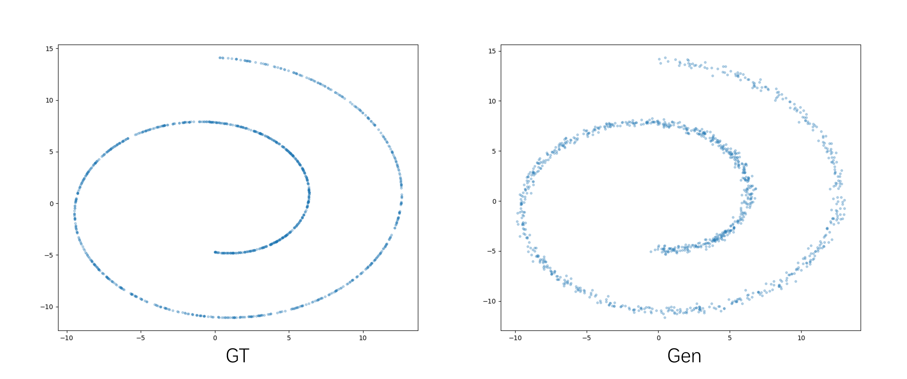
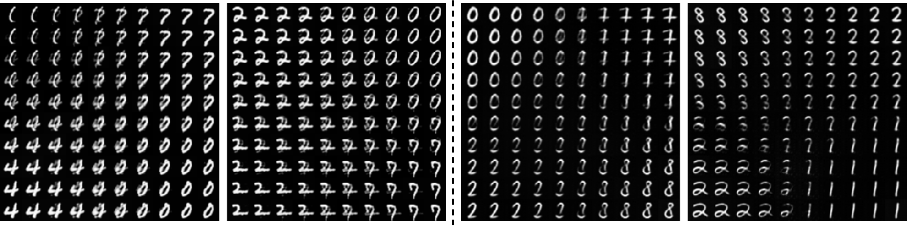
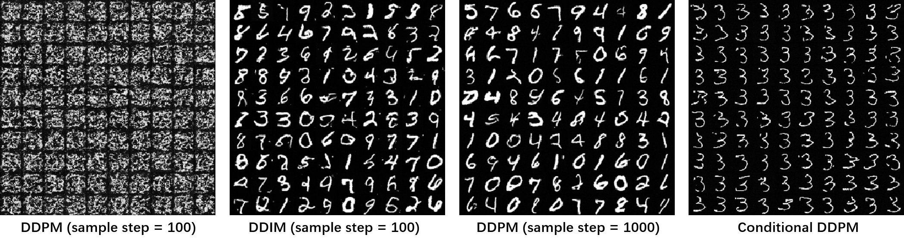
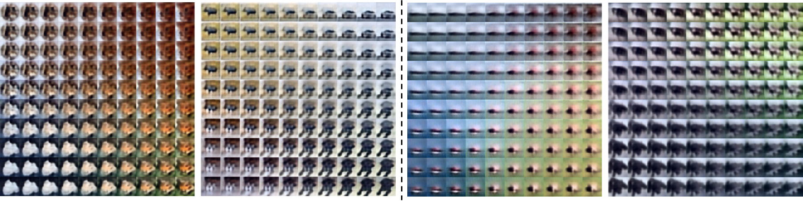
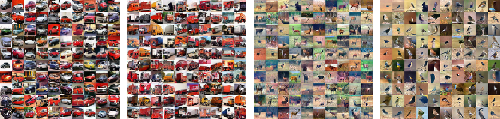

Play with Flemme
==================

After installing flemme, you can test it with some small datasets to get an intuition about its capabilities.

Toy Example for Diffusion model
-------------------------------
Configuration file: `resources/toy_ddpm.yaml <https://github.com/wlsdzyzl/flemme/tree/main/resources/toy_ddpm.yaml>`_.

.. code-block:: console

  train_flemme --config resources/toy_ddpm.yaml

MINST
------ 

Configuration files are in  `resources/img/mnist <https://github.com/wlsdzyzl/flemme/tree/main/resources/img/mnist>`_.

AutoEncoder & Variational AutoEncoder
^^^^^^^^^^^^^^^^^^^^^^^^^^^^^^^^^^^^^^^^^^^^^^^

Denoising Diffusion Probabilistic Model
^^^^^^^^^^^^^^^^^^^^^^^^^^^^^^^^^^^^^^^^^^^^^^^

CIFA10 
-------

Configuration files are in `resources/img/cifar10 <https://github.com/wlsdzyzl/flemme/tree/main/resources/img/cifar10>`_.

AutoEncoder & Variational AutoEncoder
^^^^^^^^^^^^^^^^^^^^^^^^^^^^^^^^^^^^^^^^^^^^^^^

Denoising Diffusion Probabilistic Model (conditional)
^^^^^^^^^^^^^^^^^^^^^^^^^^^^^^^^^^^^^^^^^^^^^^^^^^^^^^

